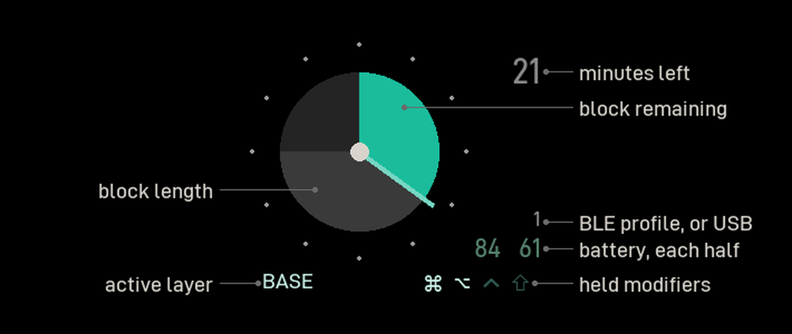
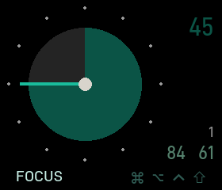
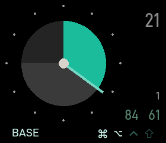
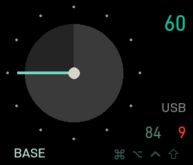
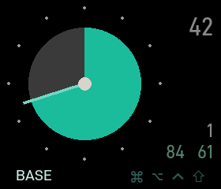
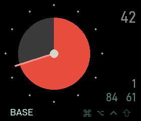
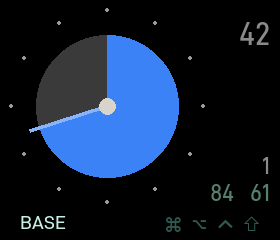
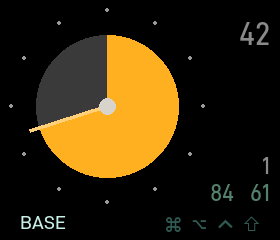
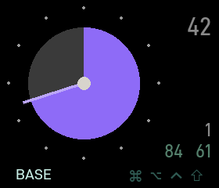
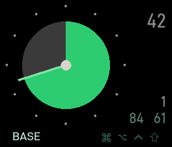

# zmk-focus-dongle

A ZMK module for the [Prospector](https://github.com/carrefinho/prospector) desktop
dongle: a focus-block timer drawn as an analogue dial, with layer, modifiers, output
profile and peripheral battery around it.

## What it looks like



**Everything on the right-hand column is a number on one ruled edge**, top to bottom:
minutes, BLE profile, batteries. They share a typeface, a size and a right margin, so
the column reads as a list rather than as a set of badges — the profile is a bare `1`,
not a decorated one, because a diagram explains it once and pixels are scarce. It reads
`USB` instead when the dongle is wired.

| armed — the length chosen, not started | running | overrun |
| --- | --- | --- |
|  |  |  |

The disc is an absolute 60 minute face, so a 45 leaves a quarter dark and the dial reads
at a glance without knowing the block length. Arming previews the whole block dimmed;
starting lifts the wedge and the hand one step each. Past zero the theme colour **hands
over from the wedge to the numeral**, which counts up in total elapsed while the hand
keeps sweeping — two channels saying the same thing rather than colour alone.

A battery numeral turns red under 15%. A held modifier lights; an unheld one stays dim
in its place, so a chord is read by what brightened rather than by what appeared.

> Every picture here is generated by `docs/render_screen.py` from `tests/dial.snapshot`
> — **the firmware's own output** — plus the palettes and placement constants parsed out
> of the source, including the callout anchors. It is a view of what the C produced, not
> a second implementation of it.

## Six palettes

| | | |
| --- | --- | --- |
|  |  |  |
| `&focus_theme 0` — Teal | `&focus_theme 1` — Red | `&focus_theme 2` — Blue |
|  |  |  |
| `&focus_theme 3` — Amber | `&focus_theme 4` — Violet | `&focus_theme 5` — Green |

**They are named for their colours and mean nothing on their own.** Pick one you like and
never touch it again, or bind the six and give them meanings of your own — the module has
no opinion. `&focus_theme N` works **while a block is running**, unlike arming and
starting: length and elapsed time are what a stray keypress must not destroy, and a
colour destroys nothing.

A theme declares one colour, its wedge; the armed preview and the hand are derived from
it, so a palette cannot be internally inconsistent and a seventh is one devicetree node.
**Only the dial is themed** — layer name, modifier row and batteries are identical in
every palette, so switching repaints one element rather than the screen.

<details>
<summary>The author's own mapping, as an example rather than a rule</summary>

One colour per kind of work, matching a paper system the dongle sits beside, so the dial
says what the block is without a word on screen:

| palette | stands for |
| --- | --- |
| Red | urgent |
| Blue | deep work |
| Amber | admin |
| Violet | creative |
| Green | recharge |
| Teal | none of the above — the default |

The words live here rather than on the panel deliberately: 70px of usable width beside
the dial fits about six characters, and a colour you chose yourself needs no caption
after the first day.

</details>

Set the starting palette in your **dongle's** overlay, never in the keymap — the theme
nodes come from this module's display overlay, which only the dongle build applies:

```dts
chosen {
    zmk,focus-theme = &focus_violet;
};
```

## ⚠️ Status: work in progress — use at your own risk

Public because it works on my desk and someone else might want it, not because it is
finished.

- **`main` moves.** No releases, no deprecations — **pin a SHA** in your `west.yml`.
- **Largely vibe coded.** Written by an LLM to my design decisions, reviewed rather
  than hand-audited. What can be host-tested is, in CI; assume the rest shows.
- **Tested on one build:** 5-column Corne, beekeeb Prospector, macOS.
- **Unfinished:** no runtime brightness, and Latin-only layer names — kana or hanzi
  render as missing glyphs.
- **No support promised.** Issues and PRs welcome, may go unanswered.

Nothing here can brick a dongle: the UF2 bootloader is out of reach, so the worst
case is a blank screen until you flash something else.

## Credit

This exists because **[carrefinho](https://github.com/carrefinho)** designed the
Prospector dongle and popularised it. If you want one,
[buy the kit from beekeeb](https://shop.beekeeb.com/products/zmk-wireless-dongle-prospector-diy-kit)
— that is where this started.

- **Hardware** — [carrefinho/prospector](https://github.com/carrefinho/prospector),
  CERN-OHL-P-2.0
- **Shield definition** — *derived from*
  [carrefinho/prospector-zmk-module](https://github.com/carrefinho/prospector-zmk-module),
  MIT. The overlays describing the display, backlight and board wiring came from there;
  see [`NOTICE`](NOTICE) and the commit history.
- **Display driver** — Zephyr's `sitronix,st7789v`, Apache-2.0, vendored with
  carrefinho's modification adding display orientation support. Upstream Zephyr
  cannot rotate this panel. See [`NOTICE`](NOTICE).

Everything above the hardware layer — the dial, the block timer, the behaviours, the
theming and the font pipeline — is new work in this repository.

## Why a separate module

carrefinho's module is a general status screen with several layouts. This one does a
single thing: it is a timer you glance at. The screen is deliberately quiet — no
flashing, no colour transitions, no state that demands attention — and it uses only
openly licensed typefaces so it can be shared.

## Licence

MIT. See [`LICENSE`](LICENSE), and [`NOTICE`](NOTICE) for the licences of the work this
builds on.
